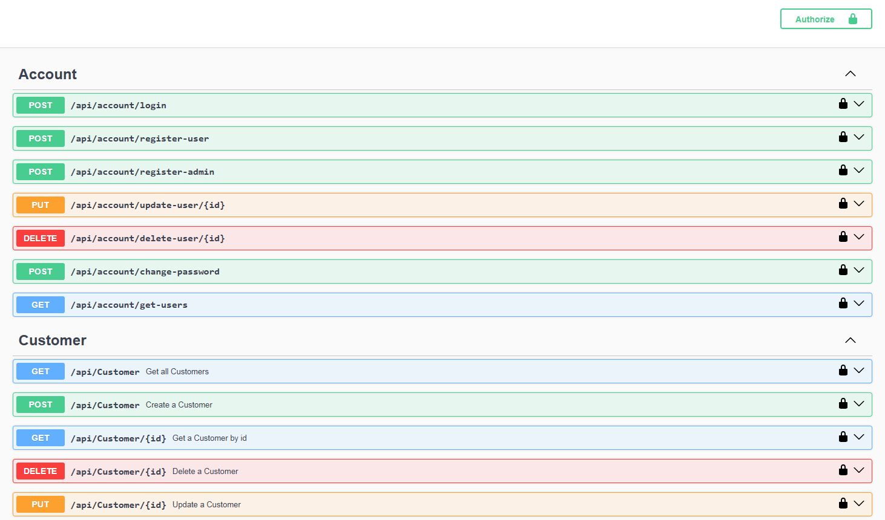
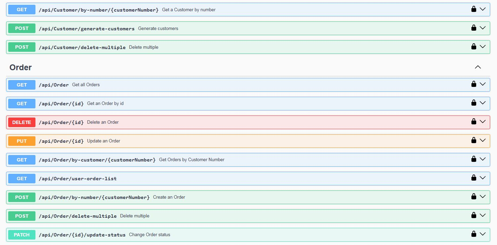
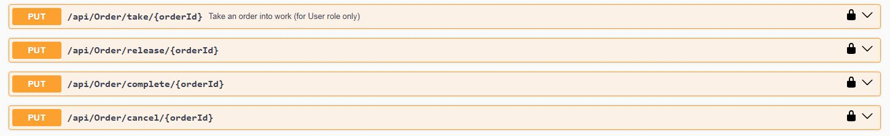

# WeningerDemoBackend

A simple CRM API for a custom orthopedic footwear workshop built with ASP.NET Core, Entity Framework Core, and PostgreSQL on Render.com. Designed as a backend for a future mobile application.

> 🔗 This backend is integrated with a React Native mobile frontend (built with help from ChatGPT). While the frontend is not production-polished, it serves as a working client and shows API integration in action. [View frontend on GitHub](https://github.com/vladOzhovan/WeningerDemoFrontend.git)

## 📚 Table of Contents

- [Architecture](#architecture)
- [Features](#features)
- [Prerequisites](#prerequisites)
- [Environment Variables](#environment-variables)
- [Setup and Run Locally](#setup-and-run-locally)
- [Database Migrations](#database-migrations)
- [Deployment](#deployment)
- [API Usage](#api-usage)
- [Swagger / OpenAPI](#swagger--openapi)
- [Contributing](#contributing)
- [License](#license)

---

## Architecture

The project follows a clean layered architecture:

- **Controllers**: handle HTTP requests and responses (`AccountController`, `CustomerController`, `OrderController`).
- **Services**: business logic and external interactions (`TokenService`, `OrderActionService`).
- **Repositories**: data access layer (`CustomerRepository`, `OrderRepository`).
- **Mappers**: map between domain models and DTOs (`CustomerMapper`, `OrderMapper`).
- **Models / Entities**: EF Core entities and domain models (`Customer`, `Order`, `AppUser`).
- **DTOs**: data transfer objects for requests and responses.
- **Helpers / Extensions**: common utilities (`ApplySearch`, `ApplySorting`, `QueryObject`).
- **Validators**: custom validation attributes and action filters.

---

## Features

- JWT authentication and role-based authorization (Admin, User)
- CRUD operations for Customers and Orders
- Search, sorting, and pagination via query parameters
- Batch deletion of Customers and Orders
- Order action endpoints (take, release, complete, cancel)
- PostgreSQL database on Render
- Swagger UI for interactive API documentation
- React Native mobile frontend available: [WeningerDemoFrontend](https://github.com/vladOzhovan/WeningerDemoFrontend.git)

---

## Prerequisites

- .NET 6 SDK or later
- Git
- PostgreSQL (if running locally)

---

## Environment Variables

Create a `.env` file in the project root or configure in your environment:

```bash
JWT__SigningKey=your_secret_signing_key
JWT__Issuer=your_issuer
JWT__Audience=your_audience
DATABASE_URL=Host=localhost;Port=5432;Database=demo;Username=user;Password=pass
```

- `JWT__SigningKey`: Symmetric key for signing JWTs
- `JWT__Issuer`: JWT issuer identifier
- `JWT__Audience`: JWT audience identifier
- `DATABASE_URL`: Connection string for PostgreSQL (or other supported DB)

---

## Setup and Run Locally

1. **Clone the repository**:

   ```bash
   git clone https://github.com/vladOzhovan/WeningerDemoBackend.git -b master
   cd WeningerDemoBackend
   ```

2. **Install dependencies**:

   ```bash
   dotnet restore
   ```

3. **Configure environment variables** (see above).

4. **Apply database migrations**:

   ```bash
   dotnet ef database update
   ```

5. **Run the application**:

   ```bash
   dotnet run
   ```

   The API will be available at `http://localhost:5246`.

---

## Database Migrations

- To create a new migration:

  ```bash
  dotnet ef migrations add <MigrationName>
  ```

- To update the database to the latest migration:

  ```bash
  dotnet ef database update
  ```

---

## Deployment

The API is deployed on Render.com:

- **Production URL**: [https://weningerdemobackend.onrender.com](https://weningerdemobackend.onrender.com)
- PostgreSQL database provisioned via Render’s managed PostgreSQL service

Continuous deployment can be set up by connecting the GitHub repository to Render and enabling auto-deploy on pushes to `master`.

---

## API Usage

Base URL (production): `https://weningerdemobackend.onrender.com/api` Base URL (local): `http://localhost:5246/api`

### Customers

- **Get all customers**

  ```bash
  curl -X GET https://weningerdemobackend.onrender.com/api/customers
  ```

- **Get customer by ID**

  ```bash
  curl -X GET https://weningerdemobackend.onrender.com/api/customers/5
  ```

- **Create a new customer** (Admin only)

  ```bash
  curl -X POST https://weningerdemobackend.onrender.com/api/customers \
    -H "Content-Type: application/json" \
    -H "Authorization: Bearer $TOKEN" \
    -d '{
      "customerNumber": 12345,
      "firstName": "Ivan",
      "secondName": "Petrov",
      "email": "ivan.petrov@example.com",
      "phoneNumber": "+1234567890",
      "address": {
        "zipCode": 10115,
        "country": "AT",
        "city": "Vienna",
        "street": "Main St",
        "houseNumber": "10",
        "apartment": "2A"
      }
    }'
  ```

- **Delete a customer** (Admin only)

  ```bash
  curl -X DELETE https://weningerdemobackend.onrender.com/api/customers/5 \
    -H "Authorization: Bearer $TOKEN"
  ```

- **Batch delete customers** (Admin only)

  ```bash
  curl -X POST https://weningerdemobackend.onrender.com/api/customers/delete-multiple \
    -H "Content-Type: application/json" \
    -H "Authorization: Bearer $TOKEN" \
    -d '[1,2,3]'
  ```

### Orders

- **Get all orders**

  ```bash
  curl -X GET https://weningerdemobackend.onrender.com/api/orders
  ```

- **Get order by ID**

  ```bash
  curl -X GET https://weningerdemobackend.onrender.com/api/orders/5
  ```

- **Create an order** (Admin only)

  ```bash
  curl -X POST https://weningerdemobackend.onrender.com/api/orders/by-number/12345 \
    -H "Content-Type: application/json" \
    -H "Authorization: Bearer $TOKEN" \
    -d '{
      "title": "Custom Insoles",
      "description": "Orthopedic insoles for Ivan",
      "status": 1
    }'
  ```

- **Take an order** (User only)

  ```bash
  curl -X PUT https://weningerdemobackend.onrender.com/api/orders/take/5 \
    -H "Authorization: Bearer $TOKEN"
  ```

- **Complete an order** (User only)

  ```bash
  curl -X PUT https://weningerdemobackend.onrender.com/api/orders/complete/5 \
    -H "Authorization: Bearer $TOKEN"
  ```

---

## Swagger / OpenAPI

Interactive API docs are available at:

```
https://weningerdemobackend.onrender.com
```

You can test all endpoints directly from the browser.

### Preview




---

## Contributing

Contributions are welcome! Please open issues or pull requests in the GitHub repository.

---

## License

MIT © Vlad Ozhovan

